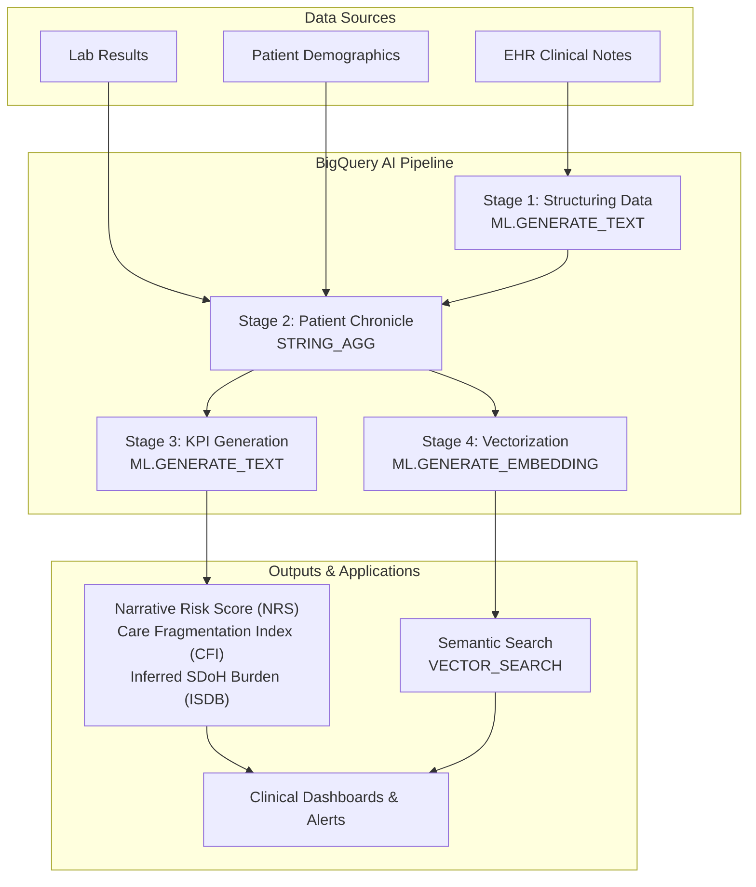

# Project Asclepius v2.0: An AI-Powered Semantic Layer for Proactive Healthcare

**A BigQuery AI Hackathon Submission**

---

## 1. The Problem: Data-Rich, Insight-Poor Healthcare

Healthcare organizations generate terabytes of data, but up to 80% of it is **unstructured**: clinical notes, discharge summaries, and patient messages. This rich data, full of context about a patient's life and struggles, is largely invisible to traditional analytics that rely on structured billing codes. This creates a critical blind spot known as **"data obscurity,"** where hidden patient risks go undetected, leading to reactive care, poor outcomes, and inefficient, costly manual chart reviews.

## 2. Our Solution: The AI-Powered Semantic Layer

**Project Asclepius v2.0** is a prototype built entirely within Google BigQuery that transforms raw, unstructured EHR data into an intelligent, actionable semantic layer. By combining the **AI Architect** and **Semantic Detective** approaches, we use BigQuery's generative AI and vector search to understand the *meaning* behind clinical text. This enables a fundamental shift from reactive to **proactive, patient-centric care**.

### Core Innovations

Our solution introduces three novel Key Performance Indicators (KPIs) generated directly from clinical narratives:

1.  **Narrative Risk Score (NRS):** A holistic 0-100 risk score that synthesizes clinical complexity, social burden, and care fragmentation into a single, intuitive metric.
2.  **Care Fragmentation Index (CFI):** A score that quantifies breakdowns in care coordination, such as conflicting medical advice or poor handoffs between departments.
3.  **Inferred Social Determinant Burden (ISDB):** An index that measures the impact of non-clinical factors (e.g., housing instability, unemployment) on a patient's health.

These AI-driven KPIs provide a 360-degree view of the patient, empowering care teams to intervene earlier and more effectively.

### Architectural Overview

Our entire pipeline lives and breathes in BigQuery, demonstrating a truly data-warehouse-native approach to AI.

## 3. How It Works: A Tour of the BigQuery AI Toolkit

We leveraged two primary hackathon approaches: **The AI Architect** and **The Semantic Detective**.

#### **Phase 1: Structuring Chaos (The AI Architect)**

We use `ML.GENERATE_TEXT` with the Gemini model to read raw clinical notes and extract structured information. Through careful prompt engineering, we instruct the model to act as a clinical expert, identifying and categorizing dozens of data points into a clean JSON format directly within SQL.

#### **Phase 2: Building the Narrative**

All patient events, including structured labs, demographics, and AI-parsed notes, are aggregated into a single chronological timeline. We use `ML.GENERATE_TEXT` again to read this entire timeline and write a comprehensive, narrative summary of the patient's hospital stay.

#### **Phase 3: Unlocking Semantic Meaning (The Semantic Detective)**

1.  **KPI Generation:** We feed the AI-generated summaries back into Gemini with prompts designed to calculate our novel KPIs (NRS, CFI, and ISDB).
2.  **Vector Embeddings:** We use `ML.GENERATE_EMBEDDING` to convert each patient summary into a high-dimensional vector. This vector captures the semantic "essence" of the patient's journey.
3.  **Semantic Search:** Using `VECTOR_SEARCH`, we enable clinicians to search for patients using natural language. A query like *"elderly patient living alone with multiple falls and transportation issues"* will find clinically similar cases based on vector similarity, not just keyword matches.

## 4. The Impact: From Insights to Outcomes

The business and clinical impact of this solution is transformative:

-   **Cost Savings & Efficiency:** By identifying high-risk patients proactively, hospitals can reduce costly readmissions. We estimate this solution could save **hundreds of hours of manual chart review per week** for a medium-sized hospital by automating the synthesis of patient data.
-   **Improved Patient Outcomes:** Early intervention for social barriers and care fragmentation leads to better health outcomes, reduced length of stay, and increased patient satisfaction.
-   **Enhanced Clinical Effectiveness:** Semantic search allows clinicians to find historical precedents for complex cases in seconds, not hours, accelerating diagnosis and treatment planning.

Project Asclepius v2.0 demonstrates that by embedding AI directly into the data warehouse, we can build powerful, scalable, and cost-effective solutions that solve profound real-world problems. We've turned a mountain of messy data into a source of life-saving wisdom.

---

### How to Run This Project

1.  **Prerequisites:** Ensure you have a GCP project with BigQuery and Vertex AI APIs enabled, along with the necessary permissions.
2.  **Setup:** Run the setup cells in the [Jupyter Notebook](./project_asclepis_v22.ipynb) to create the schema and configure the Vertex AI connection.
3.  **Execution:** Execute the notebook cells sequentially. The full pipeline is orchestrated within the notebook.
4.  **Explore:** Use the final views and functions to explore the AI-generated KPIs and test the semantic search capabilities.
Project Asclepius v2.0 demonstrates that by embedding AI directly into the data warehouse, we can build powerful, scalable, and cost-effective solutions that solve profound real-world problems. We've turned a mountain of messy data into a source of life-saving wisdom.

---

### How to Run This Project

1.  **Prerequisites:** Ensure you have a GCP project with BigQuery and Vertex AI APIs enabled, along with the necessary permissions.
2.  **Setup:** Run the setup cells in the [Jupyter Notebook](./proj%20(1).ipynb) to create the schema and configure the Vertex AI connection.
3.  **Execution:** Execute the notebook cells sequentially. The full pipeline is orchestrated within the notebook.
4.  **Explore:** Use the final views and functions to explore the AI-generated KPIs and test the semantic search capabilities.
